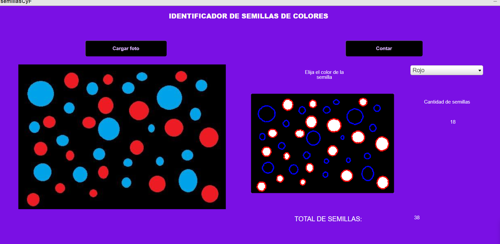

<link rel="stylesheet" href="./read.css">
<h1 class="style">SEED COUNTER</h1>
<h2>About this Project</h2>

In this project the goal is that an image is uploaded from the computer and the algorithm counts the objects of a color that the user chooses from the available rgb such as: red, green, blue, yellow, cyan and magenta, it also counts the total of the seeds and shows a scale image with the identified seeds.

<h2>Project status</h2>

This project was made and finished in 2017.

<h2>Technologies utilized</h2>

Matlab and GUIDE from Matlab.

<h2>Glossary</h2>

What is Matlab and Guide?

GUIDE (GUI development environment) provides tools to design user interfaces for custom apps.

MATLAB is a programming and numeric computing platform that offers an integrated development environment with its own programming language used by millions of engineers and scientists to analyze data, develop algorithms, and create models.

<h2>Contributor</h2>

Diana Laura Flores, Areli Cabrera.

